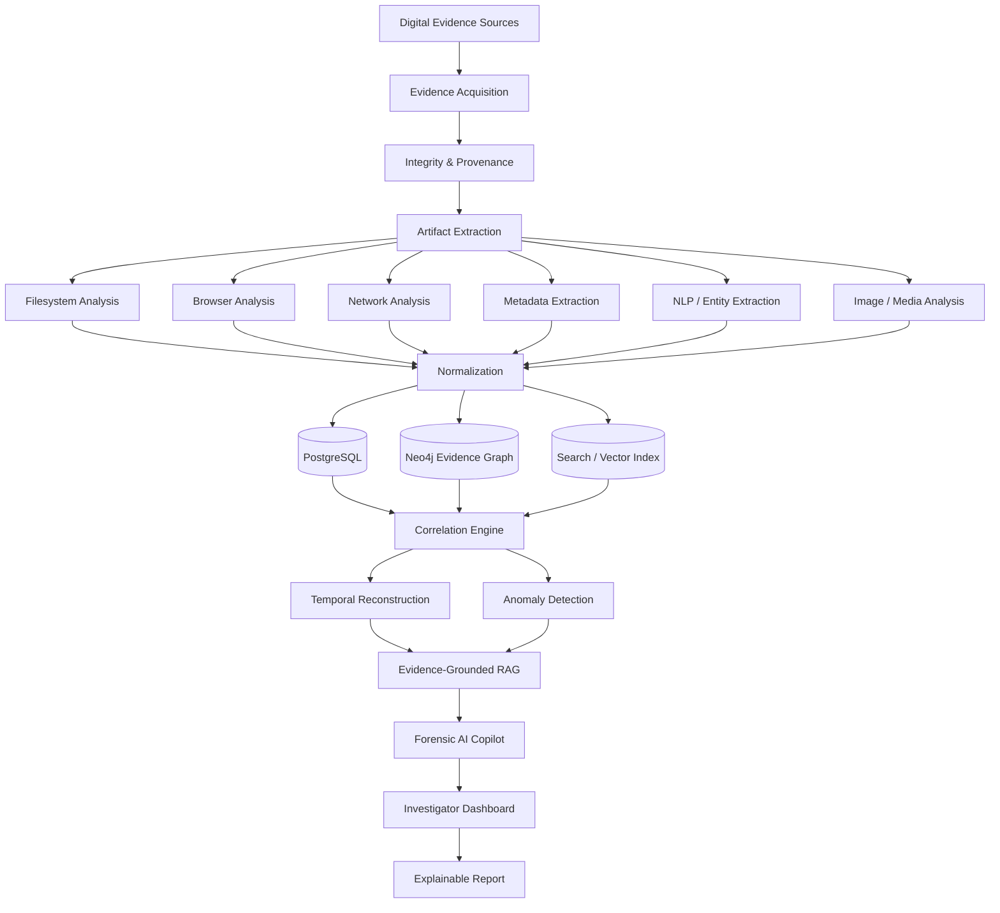
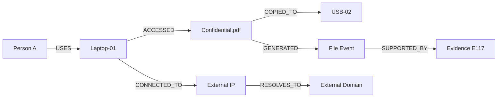
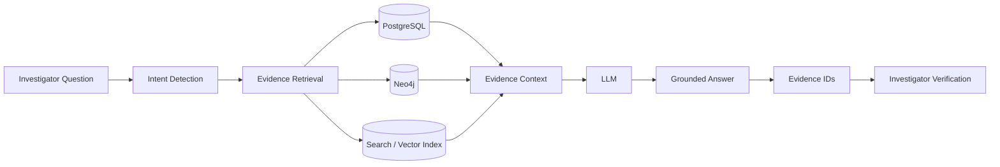
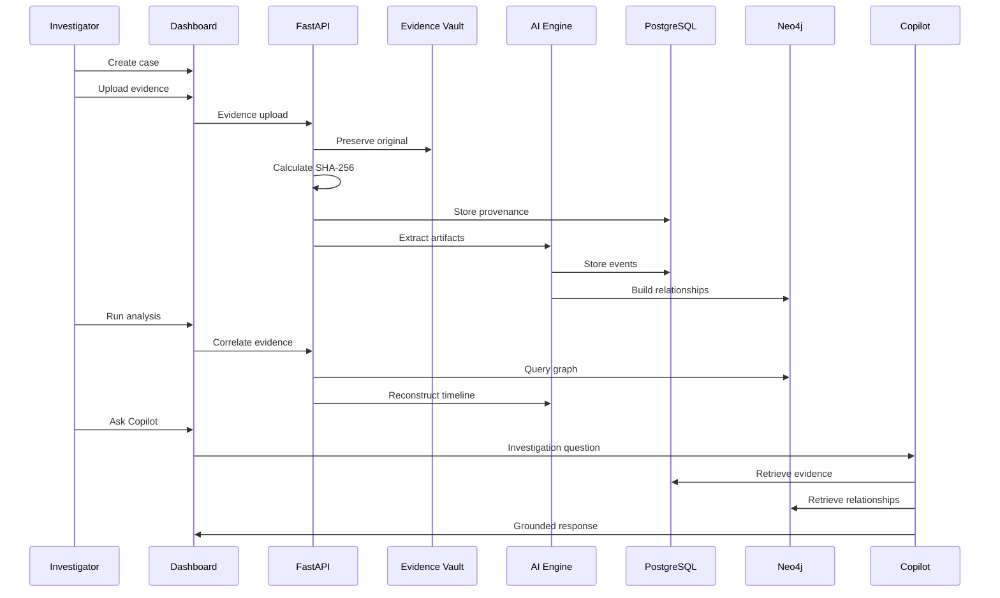
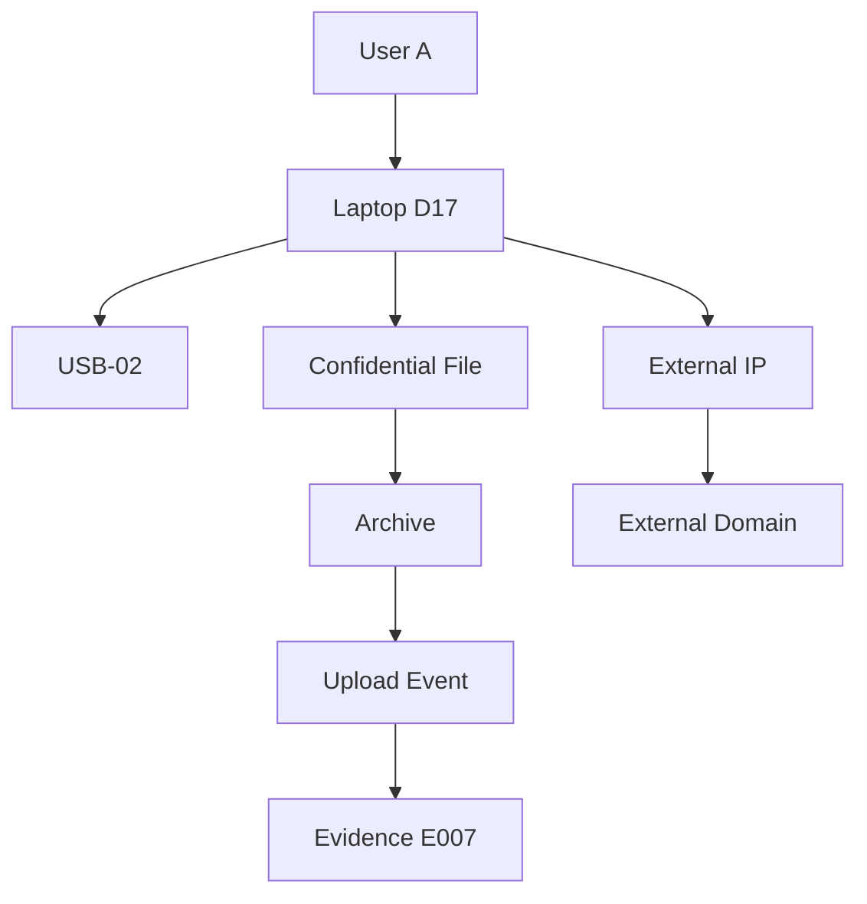

# 🛡️ NyayaForensics AI

### **AI-Powered Indigenous Digital Forensics & Evidence Intelligence Framework**

> **Preserve the evidence. Connect the traces. Reconstruct the incident. Explain the finding.**

[](https://www.python.org/)
[](https://fastapi.tiangolo.com/)
[](https://react.dev/)
[](https://www.postgresql.org/)
[](https://neo4j.com/)
[](https://www.docker.com/)
[](LICENSE)

---

## 🚨 The Problem

Digital investigations today generate enormous amounts of heterogeneous evidence:

* 💻 Computer and mobile artifacts
* 🌐 Browser history and network logs
* 📧 Emails and messages
* 📁 Files and metadata
* 🔌 USB/removable-media activity
* 🧠 Memory artifacts
* 🖼️ Images, audio and video
* ☁️ Cloud evidence
* 🔐 Authentication and access logs

The difficult part is no longer simply **collecting evidence**.

The real challenge is:

> **How do we transform thousands of fragmented digital artifacts into a trustworthy, explainable and chronologically coherent incident narrative?**

Traditional investigation workflows often require analysts to manually switch between tools, correlate timestamps, inspect metadata, identify entities and reconstruct relationships.

This creates:

```text
More Evidence
     ↓
More Complexity
     ↓
More Manual Correlation
     ↓
More Investigator Time
     ↓
Greater Risk of Missing Relationships
```

---

# 💡 The Solution

## NyayaForensics AI

NyayaForensics AI is a modular digital-forensics intelligence framework that combines:

```text
          DIGITAL EVIDENCE
                 │
                 ▼
        ┌─────────────────┐
        │ Evidence Vault  │
        └────────┬────────┘
                 │
                 ▼
        ┌─────────────────┐
        │ Integrity +     │
        │ Provenance      │
        └────────┬────────┘
                 │
                 ▼
        ┌─────────────────┐
        │ Artifact        │
        │ Extraction      │
        └────────┬────────┘
                 │
                 ▼
        ┌─────────────────┐
        │ AI Correlation  │
        └────────┬────────┘
                 │
          ┌──────┴───────┐
          ▼              ▼
    Evidence Graph    Timeline
          │              │
          └──────┬───────┘
                 ▼
        ┌─────────────────┐
        │ Anomaly /       │
        │ Pattern Engine  │
        └────────┬────────┘
                 │
                 ▼
        ┌─────────────────┐
        │ Evidence-       │
        │ Grounded AI     │
        │ Copilot         │
        └────────┬────────┘
                 │
                 ▼
        ┌─────────────────┐
        │ Investigator    │
        │ Report          │
        └─────────────────┘
```

### Core philosophy

> **AI assists the investigator; cryptographic integrity and original evidence remain the foundation.**

The framework deliberately separates:

| Layer          | Meaning                                     |
| -------------- | ------------------------------------------- |
| **Observed**   | Directly supported by an artifact           |
| **Correlated** | Supported by multiple related artifacts     |
| **Inferred**   | AI/statistical interpretation               |
| **Verified**   | Confirmed by investigator/source validation |

This distinction is fundamental to trustworthy forensic AI.

---

# 🌟 What Makes This Project Innovative?

NyayaForensics AI is not simply an LLM wrapped around a forensic database.

Its central innovation is the combination of:

### 🔐 Evidence Integrity

*

### 🕸️ Knowledge Graph Correlation

*

### 🕒 Temporal Reconstruction

*

### 🚨 Anomaly Detection

*

### 🤖 Evidence-Grounded Generative AI

```text
                  ┌────────────────────┐
                  │  DIGITAL EVIDENCE  │
                  └─────────┬──────────┘
                            │
                            ▼
                  ┌────────────────────┐
                  │ CRYPTOGRAPHIC     │
                  │ PROVENANCE        │
                  └─────────┬──────────┘
                            │
                            ▼
                  ┌────────────────────┐
                  │ EVIDENCE GRAPH     │
                  └─────────┬──────────┘
                            │
                            ▼
                  ┌────────────────────┐
                  │ TEMPORAL REASONING│
                  └─────────┬──────────┘
                            │
                            ▼
                  ┌────────────────────┐
                  │ AI CORRELATION     │
                  └─────────┬──────────┘
                            │
                            ▼
                  ┌────────────────────┐
                  │ EXPLAINABLE        │
                  │ INVESTIGATION      │
                  └────────────────────┘
```

---

# 🧠 System Architecture



---

# 🔐 1. Cryptographic Evidence Integrity

Every evidence object receives a cryptographic fingerprint.

For an evidence object \(E\):

$$
H = SHA256(E)
$$

where:

* \(E\) = original evidence bytes
* \(H\) = 256-bit cryptographic digest

If evidence changes:

$$
E \neq E'
$$

then, under normal cryptographic assumptions:

$$
SHA256(E) \neq SHA256(E')
$$

The system therefore records:

```text
Evidence ID
     │
     ├── Filename
     ├── Size
     ├── MIME Type
     ├── SHA-256
     ├── Source
     ├── Acquisition Time
     ├── Storage Location
     └── Provenance
```

### Why this matters

AI should never be responsible for deciding whether an evidence hash matches.

That is a **deterministic integrity operation**.

---

# 🧬 2. Evidence Provenance

Every derived artifact should be traceable back to its source.

```text
Original Evidence
       │
       ▼
Artifact Extraction
       │
       ▼
Normalized Artifact
       │
       ▼
Entity
       │
       ▼
Event
       │
       ▼
Correlation
       │
       ▼
Investigation Finding
```

Formally:

$$
E \rightarrow A \rightarrow X \rightarrow V \rightarrow F
$$

where:

* \(E\) = evidence
* \(A\) = artifact
* \(X\) = extracted entity
* \(V\) = event
* \(F\) = finding

This creates a machine-readable chain of explanation.

---

# 🕸️ 3. Evidence Knowledge Graph

A conventional database answers:

> **What records exist?**

A graph additionally helps answer:

> **How are those records connected?**

### Example entities

```text
Person
Device
File
USB
IP Address
Domain
Email
Process
Event
Evidence
Location
```

### Example relationships

```text
OWNS
USES
ACCESSED
CREATED
MODIFIED
COPIED_TO
CONNECTED_TO
VISITED
DOWNLOADED
UPLOADED
SUPPORTED_BY
```

### Example graph



### Graph reasoning

Suppose:

$$
P \rightarrow D \rightarrow F \rightarrow U
$$

and independently:

$$
D \rightarrow IP \rightarrow Domain
$$

The correlation engine can investigate whether these paths converge temporally and evidentially.

---

# 🕒 4. Temporal Incident Reconstruction

Digital evidence frequently arrives as disconnected timestamps.

NyayaForensics converts those fragments into an incident timeline.

Example:

```text
09:41 ── User Login
          │
09:43 ── USB Connected
          │
09:47 ── Sensitive File Opened
          │
09:51 ── File Copied
          │
09:54 ── Archive Created
          │
10:01 ── External Connection
          │
10:04 ── Upload Event
```

Represent an event as:

$$
e_i = (t_i, type_i, source_i, entity_i)
$$

For a set of events:

$$
E = \{e_1,e_2,\dots,e_n\}
$$

the basic timeline is:

$$
T = sort(E,t_i)
$$

But chronological sorting alone is insufficient.

NyayaForensics additionally evaluates:

$$
Correlation(e_i,e_j)
=
f(\Delta t, Entity, Source, Relationship)
$$

where:

$$
\Delta t = |t_i-t_j|
$$

This allows investigators to identify potentially meaningful event sequences.

---

# 🚨 5. Anomaly Detection

The framework supports a hybrid detection strategy.

## Rule-Based Detection

Example:

```text
USB connected
       +
Sensitive file accessed
       +
Archive created
       +
External network connection
```

↓

```text
⚠ Potential suspicious sequence
```

## ML-Based Detection

Represent behavioral characteristics as:

$$
X =
[x_1,x_2,\dots,x_n]
$$

For example:

```text
Login hour
Device novelty
File-access frequency
Network novelty
USB activity
Archive activity
```

Anomaly detection can then estimate:

$$
A(x) = anomaly\_score(x)
$$

For an Isolation Forest-style model, unusually isolated observations receive higher anomaly scores.

### Important

An anomaly is an **investigative signal**, not proof of malicious intent.

---

# 🧩 6. Contradiction Detection

The framework can identify potentially inconsistent evidence.

Example:

```text
File Metadata
Modified → 10:03

System Activity
Device unavailable → 09:30–11:00

Network Log
Upload → 10:04
```

The system produces:

```text
⚠ Potential temporal inconsistency
```

The investigator can then inspect the underlying evidence.

This is preferable to allowing an AI model to silently "correct" conflicting data.

---

# 🤖 7. Evidence-Grounded Forensic Copilot

The Copilot is designed around retrieval rather than unrestricted generation.



### Example question

> **Why is this case suspicious?**

The system retrieves relevant artifacts and generates an answer such as:

```text
The case contains a correlated sequence involving:

1. USB connection
2. Sensitive file access
3. File copy activity
4. Archive creation
5. External network communication

These artifacts form an investigative lead.

They do not, by themselves, establish intent or attribution.
```

The answer is linked to:

```text
Evidence E003
Evidence E004
Evidence E005
Evidence E007
```

---

# 📌 8. Evidence-Grounding Model

For each material AI claim:

$$
Claim
\rightarrow
EvidenceID
\rightarrow
Source
\rightarrow
Hash
$$

A conceptual grounding metric can be defined as:

$$
G =
w_cC +
w_sS +
w_pP +
w_rR
$$

where:

* \(C\) = citation coverage
* \(S\) = source reliability
* \(P\) = provenance completeness
* \(R\) = retrieval relevance
* \(w_i\) = chosen evaluation weights

This is an **engineering evaluation metric**, not a legal standard.

---

# 🛡️ 9. Observed vs Inferred Evidence

This distinction is central to responsible forensic AI.

### Observed

```text
EVENT
─────
USB connected

Source:
System log

Evidence:
E002

Classification:
OBSERVED
```

### Inferred

```text
FINDING
───────
Potential data-transfer sequence

Based on:
E002
E003
E004
E005

Classification:
AI-ASSISTED INFERENCE

Action:
INVESTIGATOR VERIFICATION
```

Therefore:

$$
AI\ Output \neq Ground\ Truth
$$

Instead:

$$
AI\ Output = Investigative\ Assistance
$$

---

# 🇮🇳 10. Indigenous / India-Focused Intelligence Layer

The platform is designed to support future India-specific forensic workflows.

## Multilingual evidence processing

Potential language support:

```text
English
Hindi
Hinglish
Tamil
Telugu
Bengali
Marathi
Gujarati
Kannada
Malayalam
Punjabi
```

Example:

```text
"kal file bhej dena"

        ↓

Language Detection
        ↓
Hindi / Hinglish
        ↓
Temporal Expression
        ↓
"Tomorrow"
        ↓
Entity
        ↓
File
        ↓
Intent
        ↓
Transfer
```

## India-focused fraud intelligence

Future specialized modules can target synthetic/demo patterns such as:

* phishing
* UPI-related fraud
* OTP scams
* social engineering
* fake support scams
* investment scams
* identity-related fraud
* messaging-platform abuse

> The repository should use synthetic data for demonstrations. No real victim or operational investigation data should be included.

---

# 🏗️ Technology Stack

| Layer                | Technology                      |
| -------------------- | ------------------------------- |
| Frontend             | React + TypeScript              |
| Backend              | FastAPI                         |
| Language             | Python 3.11+                    |
| Relational Database  | PostgreSQL                      |
| Graph Database       | Neo4j                           |
| Cache / Queue        | Redis                           |
| ML                   | scikit-learn                    |
| NLP                  | Transformers / spaCy            |
| Embeddings           | Sentence Transformers           |
| Vision               | OpenCV                          |
| Forensic Integration | Sleuth Kit / Plaso / Volatility |
| Metadata             | ExifTool                        |
| Detection            | YARA                            |
| Network              | TShark                          |
| Object Storage       | MinIO                           |
| Deployment           | Docker                          |
| Authentication       | JWT / RBAC-ready                |

---

# 📂 Project Architecture

```text
NyayaForensics_AI/
│
├── frontend/
│   └── React Investigator Dashboard
│
├── backend/
│   ├── api/
│   ├── models/
│   ├── schemas/
│   ├── services/
│   └── workers/
│
├── ai/
│   ├── anomaly_detection/
│   ├── inference/
│   ├── prompts/
│   └── tamper_detection/
│
├── forensic-engine/
│   ├── filesystem/
│   ├── browser/
│   ├── metadata/
│   ├── network/
│   └── yara/
│
├── database/
│   ├── postgres/
│   └── neo4j/
│
├── datasets/
│   └── synthetic/
│
├── docs/
│   ├── architecture/
│   ├── methodology/
│   └── threat-model/
│
├── docker-compose.yml
├── .env.example
└── README.md
```

---

# 🔄 End-to-End Investigation Flow



---

# 🔐 Security Architecture

Digital forensic systems deal with extremely sensitive information.

The architecture therefore follows:

## Least Privilege

```text
             ADMIN
               │
       ┌───────┼────────┐
       ▼       ▼        ▼
 INVESTIGATOR ANALYST  AUDITOR
```

## Evidence Isolation

```text
Original Evidence
       │
       ├── READ ONLY
       │
       └── Never overwritten
               │
               ▼
        Derived Artifacts
```

Potential controls:

* SHA-256 integrity verification
* RBAC
* JWT authentication
* encrypted transport
* isolated evidence storage
* audit logging
* parser sandboxing
* PII masking
* prompt-injection protection
* local/self-hosted deployment

---

# 📊 Evaluation Methodology

A forensic AI project should not be judged only by how attractive its UI looks.

NyayaForensics should be evaluated quantitatively.

## Artifact Extraction

$$
Precision =
\frac{TP}{TP+FP}
$$

$$
Recall =
\frac{TP}{TP+FN}
$$

$$
F1 =
2\frac{Precision\cdot Recall}
{Precision+Recall}
$$

---

## Timeline Reconstruction

Given ground-truth timeline:

$$
T_{true}
$$

and reconstructed timeline:

$$
T_{pred}
$$

define:

$$
TimelineAccuracy =
\frac{CorrectlyOrderedEvents}
{ComparableEvents}
$$

---

## AI Grounding

$$
GroundingRate =
\frac{SupportedMaterialClaims}
{TotalMaterialClaims}
$$

---

## Citation Accuracy

$$
CitationAccuracy =
\frac{CorrectEvidenceReferences}
{TotalEvidenceReferences}
$$

---

## Hallucination Rate

$$
HallucinationRate =
\frac{UnsupportedMaterialClaims}
{TotalMaterialClaims}
$$

A strong system should aim for:

```text
↑ Evidence Coverage
↑ Citation Accuracy
↑ Timeline Accuracy

↓

↓ Unsupported Claims
↓ False Positives
↓ Investigator Search Time
```

---

# 🧪 Demonstration Case

The included synthetic case models a hypothetical insider-data-transfer scenario.

### Evidence

```text
Browser history
System events
Filesystem events
Sensitive document
USB activity
Network activity
```

### Reconstructed sequence

```text
LOGIN
  ↓
USB CONNECT
  ↓
FILE OPEN
  ↓
FILE COPY
  ↓
ARCHIVE CREATE
  ↓
NETWORK CONNECTION
  ↓
UPLOAD
```

### Evidence graph



---

# 🎬 3-Minute Judge Demo

A strong demonstration should focus on the **investigation story**, not the code.

### Step 1 — Create Case

```text
CASE-2026-001
Potential Data Transfer
```

### Step 2 — Import Evidence

Show:

```text
Evidence ID
SHA-256
Source
Timestamp
Provenance
```

### Step 3 — Run Correlation

Display:

```text
7 correlated events
```

### Step 4 — Show Timeline

```text
Login
 ↓
USB
 ↓
File Access
 ↓
Copy
 ↓
Archive
 ↓
Network
 ↓
Upload
```

### Step 5 — Show Graph

Demonstrate how:

```text
User
 ↓
Device
 ↓
File
 ↓
USB
 ↓
Network
 ↓
External Domain
```

becomes a connected evidence graph.

### Step 6 — Ask Copilot

> **Why is this case suspicious?**

### Step 7 — Ask the critical follow-up

> **Show me the evidence supporting your answer.**

This final question demonstrates the project's differentiator:

> **The AI does not merely produce an answer; it points back to the evidence behind the answer.**

---

# 🏆 Why Judges Should Care

NyayaForensics AI combines multiple engineering disciplines:

```text
Cybersecurity
      +
Digital Forensics
      +
Artificial Intelligence
      +
Knowledge Graphs
      +
Natural Language Processing
      +
Data Engineering
      +
Cryptography
      +
Human-Centered Design
```

The project therefore demonstrates more than a conventional CRUD application or chatbot.

It demonstrates a complete **AI-assisted investigation pipeline**.

---

# 🔬 Research Direction

### Proposed research theme

> **Evidence-Grounded Multimodal Correlation for Explainable Digital Forensic Investigation**

### Research question

> Can evidence-grounded multimodal correlation reduce investigator effort while maintaining traceability between AI-generated investigative findings and their underlying digital evidence?

### Experimental hypothesis

$$
H_1:
Evidence\text{-}Grounded\ Correlation
\rightarrow
Reduced\ Investigation\ Time
$$

while maintaining:

$$
GroundingAccuracy \geq Baseline
$$

and reducing:

$$
UnsupportedClaims
$$

---

# 🚀 Roadmap

## Phase 1 — MVP

* [x] Evidence management
* [x] SHA-256 hashing
* [x] Artifact extraction
* [x] Synthetic case dataset
* [x] Timeline API
* [x] Anomaly detection foundation
* [x] Neo4j graph foundation
* [x] Evidence-grounded Copilot foundation
* [x] Investigator dashboard
* [x] Docker architecture

## Phase 2 — Advanced Forensics

* [ ] Sleuth Kit integration
* [ ] Plaso timeline ingestion
* [ ] Volatility 3 integration
* [ ] Browser artifact parsers
* [ ] PCAP analysis
* [ ] YARA scanning
* [ ] ExifTool integration
* [ ] Memory forensics

## Phase 3 — Multimodal AI

* [ ] OCR
* [ ] Image manipulation analysis
* [ ] Audio analysis
* [ ] Video analysis
* [ ] Multilingual NLP
* [ ] Entity resolution
* [ ] Semantic evidence retrieval
* [ ] Advanced temporal reasoning

## Phase 4 — Production / Research Lab

* [ ] Immutable/WORM storage
* [ ] Hardware-backed key management
* [ ] Advanced RBAC
* [ ] Signed audit logs
* [ ] Distributed processing
* [ ] Model monitoring
* [ ] Formal validation framework

---

# 💼 Recruiter Perspective

### Skills demonstrated by this project

**Backend Engineering**

* Python
* FastAPI
* REST APIs
* asynchronous processing
* database design

**AI / ML**

* anomaly detection
* NLP
* embeddings
* RAG
* LLM integration
* explainability

**Cybersecurity**

* digital forensics
* evidence integrity
* provenance
* threat detection
* network artifacts

**Data Engineering**

* PostgreSQL
* graph databases
* entity relationships
* temporal data
* search

**DevOps**

* Docker
* service orchestration
* reproducible environments

**System Design**

* modular architecture
* evidence pipelines
* microservice-ready components
* security boundaries

---

# ⚠️ Responsible Use

NyayaForensics AI is a **research and prototype framework**.

It should not be treated as a replacement for:

* validated forensic tools,
* qualified forensic examiners,
* organizational evidence-handling procedures,
* legal processes,
* jurisdiction-specific requirements.

AI-generated results are **investigative assistance**, not definitive proof.

The included demonstration data should remain synthetic.

---

# ⭐ Project Vision

Digital evidence is growing faster than investigators can manually inspect it.

The future of digital forensics is not simply:

> **More tools.**

It is:

> **Better correlation + stronger provenance + explainable automation + investigator-centered intelligence.**

NyayaForensics AI explores that future.

---

# 🛡️ NyayaForensics AI

### **Preserve the evidence.**

### **Connect the traces.**

### **Reconstruct the incident.**

### **Explain the finding.**

```text
Evidence
   ↓
Integrity
   ↓
Artifacts
   ↓
Graph
   ↓
Timeline
   ↓
AI Correlation
   ↓
Evidence-Grounded Intelligence
   ↓
Human Verification
   ↓
Explainable Investigation
```

---

## Built for the intersection of

**Cybersecurity × Digital Forensics × AI × Graph Intelligence × Explainable Systems**
